# 👋 About me 

- Learning to code for fun in my free time    
- Uploading my random projects    
- 13 years old    

   &nbsp; &nbsp; &nbsp; &nbsp;
      

## 📌 Projects: 

<table border="0">
  <tr>
    <td>
      
    </td>
    <td>
      
    </td>
  </tr>
  <tr>
    <td>
      
    </td>
    <td>
      
    </td>
  </tr>
  <tr>
    <td>
      
    </td>
    <td>
      
    </td>
  </tr>
  <tr>
    <td>
      
    </td>
    <td>
      </td>
  </tr>
</table>
